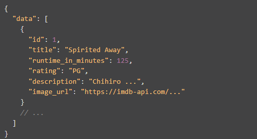
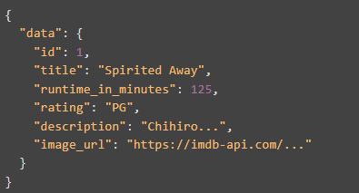
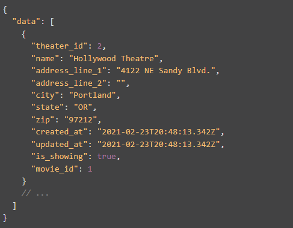
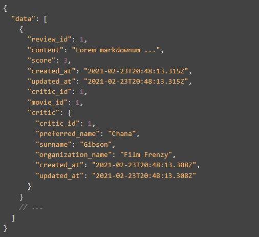
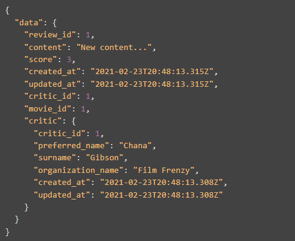
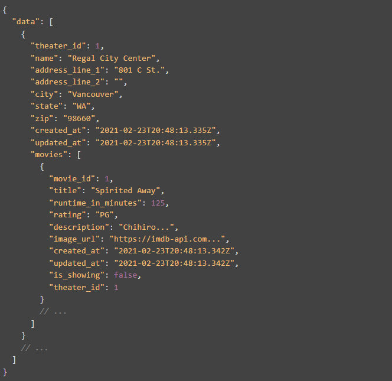

# WeLoveMovies (Back-end)
## Express/Knex JavaScript for handling back-end requests for movies, theaters, and reviews on WeLoveMovies project

[Link to deployed back-end on Render](https://welovemovies-ioz9.onrender.com/)

## Available Requests

### /movies

GET /movies
- Returns id, title, runtime, rating, description, and image url for all movies

GET /movies?is_showing=true
- Including the "is_showing=true" query returns ONLY those movies that are currently showing in theaters (using is_showing property in movies_theaters table)
- Returns each movie one time only regardless of how many theaters it is showing in

Example:

### /movies/:movieId

GET /movies/:movieID
- Returns id, title, runtime, rating, description, and image url for movie with matching ID
- Validation returns 404 if movieId does not exist in database

Example:

### /movies/:movieId/theaters

GET /movies/:movieId/theaters
- Returns all theaters where the movie with matching ID is showing (using is_showing property in movies_theaters table)
- Validation returns 404 if movieId does not exist in database

Example:

### /movies/:movieId/reviews

GET /movies/:movieId/reviews
- Returns all reviews for the movie with matching ID, including details for the critic as a nested object
- Validation returns 404 if movieId does not exist in database

Example:

### /reviews/:reviewId

DELETE /reviews/:reviewId
- Removes review with matching ID from database
- Returns 204 status with no message
- Validation returns 404 if reviewId does not exist in database

PUT /reviews/:reviewId
- Updates existing review with matching ID in database
- Returns review with updated content, including details for the critic as a nested object 
- Validation returns 404 if reviewId does not exist in database

Example:

### /theaters

GET /theaters
- Returns all theaters including array of all movies as a nested object

Example:
